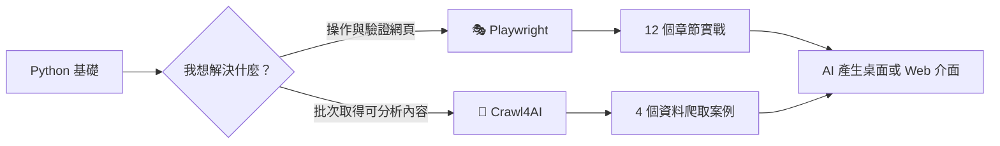

# Playwright × Crawl4AI 現代爬蟲與網頁自動化教學

> 同一個 Repo，兩條實戰路線：用 **Playwright** 學會操作真實瀏覽器，用 **Crawl4AI** 學會將網頁轉成適合分析與 AI 使用的資料。

## 一眼看懂這個 Repo

| 學習路線 | Framework 標記 | 主要目標 | 適合情境 | 課程入口 | 實戰入口 |
|---|---|---|---|---|---|
| 🎭 瀏覽器自動化 | **PLAYWRIGHT** | 精準操作與驗證網頁 | 點擊、表單、登入、截圖、下載、API Mock | [Playwright 完整課程](./playwright/README.md) | [12 個 Playwright 實戰專案](./playwright/實戰專案/README.md) |
| 🤖 AI 友善資料爬取 | **CRAWL4AI** | 批次取得乾淨、結構化內容 | Markdown、CSS Schema、批次爬取、LLM 前處理 | [Crawl4AI 完整課程](./crawl4AI/README.md) | [4 個 Crawl4AI 實際案例](#crawl4ai-實際案例) |
| 🧑‍💻 AI 協作自動化 | **WEBWRIGHT** | 用自然語言產生可重複操作 | Claude Code 內的快速瀏覽器任務 | [Webwright 說明](./tools/webwright/README.md) | `/webwright` 與 `/webwright:craft` |

### 怎麼選？

- 需要「像人一樣操作網站」：選 **🎭 Playwright**。
- 需要「把大量網頁整理成乾淨資料」：選 **🤖 Crawl4AI**。
- 尚未熟悉兩者：先學 Playwright，再學 Asyncio 與 Crawl4AI。



## 目錄

- [資料夾架構](#資料夾架構)
- [快速開始](#快速開始)
- [兩種 Framework 的核心差異](#兩種-framework-的核心差異)
- [Playwright 課程](#playwright-課程)
- [Crawl4AI 課程](#crawl4ai-課程)
- [實戰專案](#實戰專案)
  - [🎭 Playwright 實戰專案](#playwright-實戰專案)
  - [🤖 Crawl4AI 實際案例](#crawl4ai-實際案例)
- [AI 介面與延伸](#ai-介面與延伸)
- [Webwright](#webwright)
- [官方資源](#官方資源)

---

## 資料夾架構

```text
playwright_crawl4AI/
├── README.md                       # Repo 首頁與 Framework 導覽
├── playwright/                     # 🎭 Playwright 學習路線
│   ├── README.md                   # Playwright 課程總覽
│   ├── 課程章節/                    # 第 01～12 章講義與範例
│   ├── 實戰專案/                    # 12 個章節對應專案與 AI Prompt
│   └── 延伸專案/                    # PTT、維基百科、高鐵綜合專案
├── crawl4AI/                       # 🤖 Crawl4AI 學習路線
│   ├── README.md                   # Crawl4AI 課程總覽
│   ├── 課程章節/                    # 安裝、基礎、JS、多頁面、排程
│   ├── 實戰專案/                    # 匯率、股票與 GUI 專案
│   └── 部署/                        # Docker 與部署資源
├── 基礎課程/
│   └── asyncio/                   # Crawl4AI 所需的 async/await 基礎
├── tools/
│   └── webwright/                 # 自然語言瀏覽器自動化工具
├── docs/                           # Framework 比較、實戰與 AI 整合文件
├── pyproject.toml                  # Python 專案與依賴設定
└── uv.lock                         # 可重現的套件版本
```

資料夾命名原則：

- 第一層先區分 **Framework 或用途**。
- Framework 內部再區分 **課程章節、實戰專案、延伸/部署**。
- 有學習順序的資料夾使用 `01_`、`02_` 編號，讓檔案瀏覽器中的順序與課程一致。
- 生成檔、截圖、Cookie 與匯出資料放在各專案的 `output/`，不與教材混放。

---

## 快速開始

### 環境需求

- Python 3.11 或以上
- [uv](https://docs.astral.sh/uv/) Python 套件與虛擬環境工具
- 穩定網路
- 約 2 GB 以上空間安裝瀏覽器

### 安裝

Clone 專案後，在 Repo 根目錄執行：

```bash
uv sync
uv run playwright install chromium
```

需要進行多瀏覽器練習時，再安裝：

```bash
uv run playwright install firefox webkit
```

### 建議學習順序

1. [Playwright 第 01 章](./playwright/課程章節/第01章_Playwright簡介/README.md)：先理解真實瀏覽器自動化。
2. Playwright 每學完一章，就完成該章的[對應實戰專案](./playwright/實戰專案/README.md)。
3. [Asyncio 非同步編程](./基礎課程/asyncio/)：學 Crawl4AI 前先理解 `async` / `await`。
4. [Crawl4AI 課程](./crawl4AI/README.md)：學習批次爬取、內容清理與結構化。
5. 選擇一個實戰，再用 [AI 介面 Prompt](./playwright/實戰專案/AI介面設計Prompt.md) 升級成桌面 App、儀表板、Web 網站或 API。

---

## 兩種 Framework 的核心差異

| 比較項目 | 🎭 **Playwright** | 🤖 **Crawl4AI** |
|---|---|---|
| 核心定位 | 瀏覽器操作與 End-to-End 自動化 | AI 友善的網頁爬取與內容處理 |
| 主要輸出 | 互動結果、截圖、PDF、下載檔、測試結果 | Markdown、清理後內容、結構化 JSON |
| 元素處理 | role、label、CSS、XPath、test id | CSS Schema、內容過濾、擷取策略 |
| 互動能力 | 強：點擊、輸入、拖曳、上下載、popup、iframe | 以擷取流程為主，可搭配 JS 操作 |
| 批次爬取 | 需自行設計 context、async 與 concurrency | 提供 `arun_many()` 等批次能力 |
| 適合誰 | 想打好瀏覽器自動化基礎的學習者 | 已會 async，想建立資料與 AI pipeline 的學習者 |

[查看 Playwright vs Crawl4AI 完整比較 →](./docs/comparison.md)

---

## Playwright 課程

### 🎭 PLAYWRIGHT｜精準控制真實瀏覽器

Playwright 是微軟開發的現代網頁自動化工具。課程共 13 章，從啟動瀏覽器、元素定位與等待，逐步進入多頁面、iframe、網路請求、登入狀態與效能優化。

- **課程章節**：13 章
- **章節實戰**：12 個真實網站專案
- **練習網站**：SauceDemo、The Internet、Books to Scrape、Wikipedia、JSONPlaceholder、HTTPBingo 等
- **延伸學習**：12 份可直接複製的 AI 介面設計 Prompt

**開始學習：** [Playwright 完整教學講義 →](./playwright/README.md)

---

## Crawl4AI 課程

### 🤖 CRAWL4AI｜將網頁轉為 AI 友善資料

Crawl4AI 是建立在瀏覽器自動化基礎上的非同步爬蟲框架，適合批次抓取、內容清理、結構化擷取，以及為 LLM 準備 Markdown 或 JSON 資料。

- **核心主題**：安裝、初體驗、CSS Schema、JavaScript 操作、多頁面爬取、排程與 Docker
- **前置能力**：Python `async` / `await`
- **實際案例**：匯率、即時股票、批次 GUI、即時監控 GUI
- **適合延伸**：資料庫、排程、資料分析、RAG 與 LLM

**開始學習：** [Crawl4AI 完整教學講義 →](./crawl4AI/README.md)

---

## 實戰專案

以下專案使用固定標記區分 Framework：

- 🎭 **PLAYWRIGHT PROJECT**：瀏覽器操作、互動與自動化驗證。
- 🤖 **CRAWL4AI PROJECT**：網頁內容爬取、清理與結構化。

### Playwright 實戰專案

#### 🎭 PLAYWRIGHT PROJECT｜12 個真實網站任務

Playwright 專案與第 01～12 章一對一對應。建議每學完一章，立即完成當章實戰。

| # | Framework | 專案 | 主題 | 難度 |
|---:|---|---|---|---|
| 01 | 🎭 **PLAYWRIGHT** | [網站健康檢查](./playwright/實戰專案/專案01_網站健康檢查/README.md) | 導航、HTTP 狀態、標題、截圖 | ⭐ 入門 |
| 02 | 🎭 **PLAYWRIGHT** | [線上表單自動填寫](./playwright/實戰專案/專案02_線上表單自動填寫/README.md) | fill、select、check、submit | ⭐ 入門 |
| 03 | 🎭 **PLAYWRIGHT** | [購物網站元素定位](./playwright/實戰專案/專案03_購物網站元素定位/README.md) | role、test id、filter、購物車 | ⭐⭐ 初級 |
| 04 | 🎭 **PLAYWRIGHT** | [動態內容等待](./playwright/實戰專案/專案04_動態內容等待/README.md) | 自動等待、visible、Web-first assertion | ⭐⭐ 初級 |
| 05 | 🎭 **PLAYWRIGHT** | [線上書店資料擷取](./playwright/實戰專案/專案05_線上書店資料擷取/README.md) | 多元素、分頁、CSV | ⭐⭐⭐ 中級 |
| 06 | 🎭 **PLAYWRIGHT** | [進階互動巡檢](./playwright/實戰專案/專案06_進階互動巡檢/README.md) | hover、鍵盤、滾動、上下載 | ⭐⭐⭐ 中級 |
| 07 | 🎭 **PLAYWRIGHT** | [多視窗與 iframe](./playwright/實戰專案/專案07_多視窗與iframe/README.md) | popup、dialog、frame locator | ⭐⭐⭐ 中級 |
| 08 | 🎭 **PLAYWRIGHT** | [網頁存證報告](./playwright/實戰專案/專案08_網頁存證報告/README.md) | 截圖、錄影、PDF | ⭐⭐⭐ 中級 |
| 09 | 🎭 **PLAYWRIGHT** | [API 監聽與 Mock](./playwright/實戰專案/專案09_API監聽與Mock/README.md) | request/response、route、Mock JSON | ⭐⭐⭐⭐ 進階 |
| 10 | 🎭 **PLAYWRIGHT** | [登入狀態保存](./playwright/實戰專案/專案10_登入狀態保存/README.md) | Cookie、localStorage、storage state | ⭐⭐⭐⭐ 進階 |
| 11 | 🎭 **PLAYWRIGHT** | [禮貌爬蟲](./playwright/實戰專案/專案11_禮貌爬蟲/README.md) | robots.txt、身分識別、限速 | ⭐⭐⭐⭐ 進階 |
| 12 | 🎭 **PLAYWRIGHT** | [平行爬取優化](./playwright/實戰專案/專案12_平行爬取優化/README.md) | async、平行 context、資源阻擋、重試 | ⭐⭐⭐⭐⭐ 高級 |

[查看 Playwright 實戰的教學流程、驗收標準與延伸挑戰 →](./playwright/實戰專案/README.md)

### Crawl4AI 實際案例

#### 🤖 CRAWL4AI PROJECT｜4 個資料爬取與 GUI 應用

| # | Framework | 專案 | 主題 | 難度 |
|---:|---|---|---|---|
| 01 | 🤖 **CRAWL4AI** | [台灣銀行牌告匯率](./crawl4AI/實戰專案/01_台灣銀行牌告匯率/README.md) | CSS Schema、結構化匯率、定時排程 | ⭐⭐ 初級 |
| 02 | 🤖 **CRAWL4AI** | [台灣即時股票資訊](./crawl4AI/實戰專案/02_台灣即時股票資訊/README.md) | JavaScript 動態渲染、精準定位 | ⭐⭐⭐⭐ 進階 |
| 03 | 🤖 **CRAWL4AI** | [股票批次爬取 GUI](./crawl4AI/實戰專案/03_股票批次爬取_GUI/README.md) | CLI + GUI、非同步批次、並發控制 | ⭐⭐⭐⭐⭐ 高級 |
| 04 | 🤖 **CRAWL4AI** | [股票即時監控 GUI](./crawl4AI/實戰專案/04_股票即時監控_GUI/README.md) | Tkinter、多執行緒、自動更新 | ⭐⭐⭐⭐⭐ 高級 |

> Crawl4AI 案例 03 與 04 展示如何使用 AI 輔助從需求、PRD、架構到 GUI 完成專案。

[查看 Crawl4AI 實際案例的完整技術說明 →](./docs/cases.md)

### 不知道先做哪一個？

| 你的目標 | 建議專案 |
|---|---|
| 第一次開始網頁自動化 | 🎭 Playwright 01 網站健康檢查 |
| 想練習爬取表格資料 | 🤖 Crawl4AI 01 台灣銀行匯率 |
| 想練習批量商品資料與 CSV | 🎭 Playwright 05 線上書店 |
| 想理解動態 JavaScript 資料 | 🤖 Crawl4AI 02 即時股票 |
| 想建立登入、Cookie 或 API 自動化 | 🎭 Playwright 09～10 |
| 想學桌面 GUI 與背景任務 | 🤖 Crawl4AI 03～04，再對照 Playwright AI Prompt |

---

## AI 介面與延伸

完成爬蟲核心後，可以將專案升級成：

- **桌面應用**：Tkinter、PySide6 / PySide5、PyQtGraph
- **快速 Web UI**：Gradio、Streamlit
- **資料儀表板**：Dash / Plotly
- **自訂網站**：Flask
- **Web API**：FastAPI
- **資料與排程**：PostgreSQL、APScheduler
- **AI 分析**：OpenAI、Gemini、RAG 或其他 LLM

Playwright 的 12 個實戰都已準備完整、可直接複製給 AI 的介面開發 Prompt：

[開啟 AI 介面設計 Prompt 手冊 →](./playwright/實戰專案/AI介面設計Prompt.md)

[查看其他 AI 整合方向與難度表 →](./docs/ai_integration.md)

---

## Webwright

### 🧑‍💻 WEBWRIGHT｜自然語言驅動 Playwright

Webwright 是整合在 Claude Code 中、基於 Playwright 的網頁自動化助手。你可以用中文或英文描述任務，由它撰寫操作程式、執行瀏覽器流程並留下截圖。

- `/webwright`：快速執行一次性自動化或爬蟲任務。
- `/webwright:craft`：將流程封裝為可重複使用的參數化腳本。

[查看 Webwright 完整使用說明 →](./tools/webwright/README.md)

---

## 為什麼要學現代爬蟲？

傳統 HTTP 爬蟲難以處理 JavaScript 動態內容、無限滾動、互動式表單與複雜登入狀態。Playwright 與 Crawl4AI 提供真實瀏覽器、自動等待、動態內容處理與結構化輸出能力。

> 現代爬蟲不等於繞過限制。請遵守網站條款、robots.txt、個資與著作權規範，並主動限制請求速度。

---

## 官方資源

### 🎭 Playwright

- [官方網站](https://playwright.dev/)
- [Python 文件](https://playwright.dev/python)
- [API 參考](https://playwright.dev/python/docs/api/class-playwright)
- [快速入門](https://playwright.dev/python/docs/intro)
- [疑難排解](https://playwright.dev/python/docs/troubleshooting)

### 🤖 Crawl4AI

- [GitHub 官方倉庫](https://github.com/unclecode/crawl4ai)
- [Issue](https://github.com/unclecode/crawl4ai/issues)
- [官方範例](https://github.com/unclecode/crawl4ai/tree/main/examples)

---

## 課程快速入口

- 🎭 [Playwright 課程](./playwright/README.md)
- 🎭 [Playwright 12 個實戰專案](./playwright/實戰專案/README.md)
- 🤖 [Crawl4AI 課程](./crawl4AI/README.md)
- 🤖 [Crawl4AI 實際案例](./docs/cases.md)
- 🧑‍💻 [Webwright](./tools/webwright/README.md)
