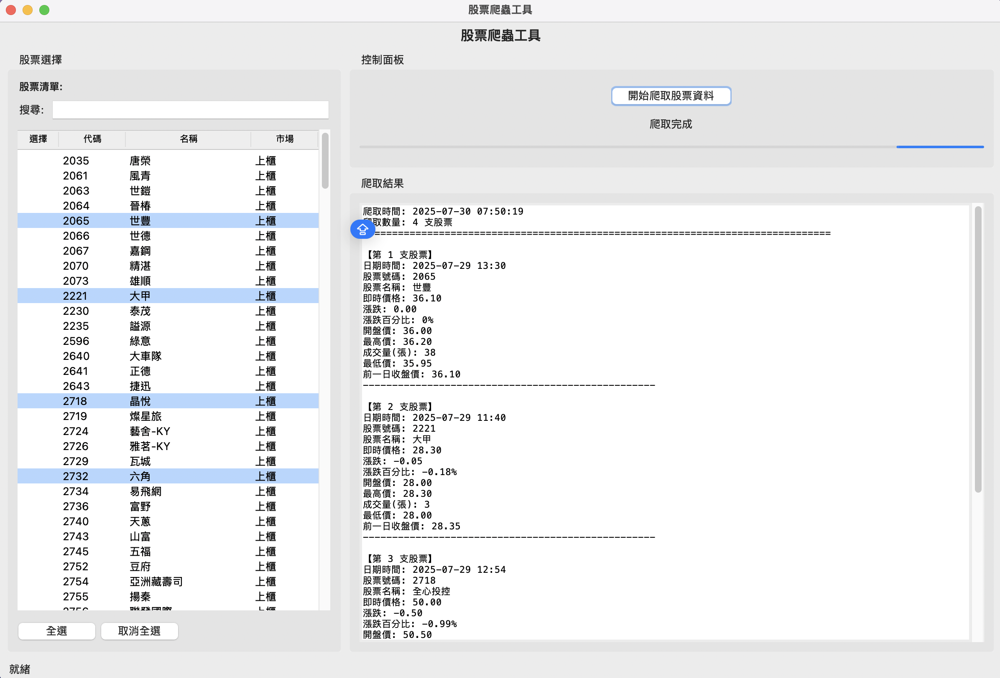

# 台灣即時股票資訊 - GUI 完整版

> ⚠️ **AI 產生專案說明**
> 本專案是由 AI 輔助開發的完整應用程式。從需求分析（PRD.md）到程式實作，都經過 AI 協助設計與生成。此專案展示了 AI 如何協助快速建立功能完整的股票爬蟲工具，適合作為學習 AI 輔助開發的範例。

## 專案簡介

這是一個功能完整的台灣股票爬蟲工具，結合 **Crawl4AI** 爬蟲框架與 **Tkinter GUI** 介面。本專案提供兩種使用模式：

1. **命令列模式**：快速爬取預設股票列表
2. **GUI 模式**：提供友善的圖形介面，支援股票搜尋、多選、批次爬取

**目標網站**: [玩股網](https://www.wantgoo.com/)

**主執行檔**: index.py

## 功能特色

### 核心功能
- 🔍 **即時股票資料爬取**：價格、漲跌、成交量等 11 項完整資訊
- 🖥️ **友善圖形介面**：直覺的 GUI 操作介面
- 📊 **批次股票爬取**：同時爬取多支股票資料
- 🔎 **股票搜尋功能**：快速搜尋股票代碼或名稱
- ⚡ **非同步爬取**：高效能並行處理（最多 5 個同時）
- 📱 **即時進度顯示**：清楚顯示爬取進度與狀態
- 💾 **完整錯誤處理**：網路錯誤自動重試機制

### 進階功能
- ✅ **全選/取消全選**：快速操作多支股票
- ✅ **速率限制**：避免對目標網站造成負擔
- ✅ **雙模式運行**：命令列模式或 GUI 模式任選
- ✅ **股票清單顯示**：查看所有可用股票

## 環境需求

### Python 版本
- Python 3.8 或以上（建議使用 3.10+）

### 相依套件
```bash
pip install crawl4ai twstock
```

## 專案結構

```
4台灣即時股票資訊_tkinter/
├── index.py             # 主程式入口（命令列選單）
├── wantgoo.py           # 爬蟲核心模組
├── stock_gui.py         # GUI 介面模組
├── PRD.md               # 產品需求文件（AI 生成）
├── README.md            # 本說明文件
└── .gitignore           # Git 忽略檔案設定
```

## 使用方式

### 1. 安裝相依套件

```bash
# 安裝 Crawl4AI 爬蟲框架
pip install crawl4ai

# 安裝 twstock（台灣股票資料庫）
pip install twstock
```

### 2. 啟動程式

```bash
cd "crawl4AI/實戰專案/03_股票批次爬取_GUI"
python index.py
```

### 3. 選擇執行模式

程式啟動後會顯示選單：

```
==================================================
🚀 股票爬蟲工具
==================================================
1. 命令列模式 - 爬取預設股票
2. GUI 模式 - 圖形介面 ⭐ 推薦
3. 顯示股票清單
4. 離開程式
```

#### 模式說明

**模式 1：命令列模式**
- 自動爬取 10 支預設股票（台積電、鴻海、聯發科等）
- 結果直接顯示在終端機
- 適合快速測試或自動化腳本

**模式 2：GUI 模式（推薦）**
- 開啟圖形介面
- 可搜尋、多選股票
- 即時顯示爬取進度與結果
- 適合一般使用者

**模式 3：顯示股票清單**
- 列出所有可用的台灣上市股票
- 顯示股票代碼與名稱

## GUI 模式使用說明

### 介面佈局

```
┌─────────────────────────────────────────────────────────┐
│               股票爬蟲工具                                  │
├──────────────────┬──────────────────────────────────────┤
│  股票選擇        │  控制面板                             │
│  ┌────────────┐ │  ┌──────────────────────────────┐   │
│  │ 搜尋: [  ] │ │  │ [ 開始爬取股票資料 ]          │   │
│  ├────────────┤ │  └──────────────────────────────┘   │
│  │ [ 全選 ]    │ │                                     │
│  │ [取消全選]  │ │  爬取進度                           │
│  ├────────────┤ │  ┌──────────────────────────────┐   │
│  │股票清單:    │ │  │                               │   │
│  │☑ 2330 台積電│ │  │ 正在爬取股票資料...           │   │
│  │☐ 2317 鴻海  │ │  │                               │   │
│  │☐ 2454 聯發科│ │  │                               │   │
│  │☐ 2412 中華電│ │  │                               │   │
│  │...         │ │  │                               │   │
│  │            │ │  │                               │   │
└──────────────────┴──────────────────────────────────────┘
```

### 操作步驟

#### 1. 搜尋股票
- 在搜尋框輸入股票代碼或名稱
- 列表會即時過濾符合的股票
- 範例：輸入 "台積" 會篩選出台積電

#### 2. 選擇股票
- **單選**：點擊單一股票前的核取方塊
- **多選**：依序點擊多個股票
- **全選**：點擊「全選」按鈕選擇所有股票
- **取消**：點擊「取消全選」清除所有選擇

#### 3. 開始爬取
- 點擊「開始爬取股票資料」按鈕
- 觀察進度顯示區的即時訊息
- 等待爬取完成

#### 4. 查看結果
- 爬取結果會顯示在右側結果區
- 每支股票顯示完整的 11 項資訊
- 格式化 JSON 輸出，易於閱讀

## 爬取的資料欄位

每支股票會爬取以下完整資訊：

| 欄位名稱 | 說明 | 範例 |
|---------|------|------|
| 日期時間 | 股票報價更新時間 | "2025/01/15 14:30:00" |
| 股票號碼 | 股票代碼 | "2330" |
| 股票名稱 | 公司名稱 | "台積電" |
| 即時價格 | 當前成交價格 | "615.00" |
| 漲跌 | 與前日收盤價差 | "+5.00" |
| 漲跌百分比 | 漲跌幅度百分比 | "+0.82%" |
| 開盤價 | 當日開盤價格 | "610.00" |
| 最高價 | 當日最高價格 | "617.00" |
| 最低價 | 當日最低價格 | "609.00" |
| 成交量(張) | 當日成交量 | "45,678" |
| 前一日收盤價 | 昨日收盤價 | "610.00" |

## 技術架構

### 核心技術棧
- **Crawl4AI**: 現代化的網頁爬蟲框架
- **twstock**: 台灣股票資料庫套件
- **Tkinter**: Python 內建的 GUI 框架
- **asyncio**: 非同步程式設計支援

### 爬蟲策略
- **CSS 選擇器**: 精確提取資料
- **並發爬取**: 最多 5 個請求同時進行
- **速率限制**: 每個請求間隔 0.5 秒
- **錯誤處理**: 自動重試機制
- **進度回報**: 即時更新爬取狀態

### 程式碼結構

#### index.py - 主程式入口
```python
def main():
    """命令列模式：爬取預設 10 支股票"""
    urls = [...]  # 預設股票列表
    results = asyncio.run(wantgoo.get_stock_data(urls))
    # 顯示結果...

if __name__ == "__main__":
    # 顯示選單
    # 根據使用者選擇執行不同模式
```

#### wantgoo.py - 爬蟲核心
```python
async def get_stock_data(urls, progress_callback=None):
    """
    批次爬取股票資料
    - 使用 Crawl4AI 框架
    - 支援進度回報
    - 並發控制（Semaphore）
    - 錯誤處理
    """

def get_stocks_with_twstock():
    """取得所有台灣上市股票清單"""
```

#### stock_gui.py - GUI 介面
```python
class StockCrawlerGUI:
    """
    股票爬蟲 GUI 主類別
    - 建立介面佈局
    - 處理使用者互動
    - 非同步執行爬蟲
    - 即時更新進度
    """
```

## 與其他專案的比較

| 特性 | 專案 2 | 專案 3 | 專案 4（本專案） |
|-----|-------|-------|----------------|
| **介面類型** | 命令列 | GUI（即時監控） | GUI（批次爬取） + 命令列 |
| **股票選擇** | 修改程式碼 | 介面多選 | 介面多選 + 搜尋 |
| **使用模式** | 單次執行 | 持續監控 | 批次爬取 |
| **自動更新** | 不支援 | 每 60 秒 | 手動觸發 |
| **視覺化** | 純文字 | 表格+顏色 | 格式化 JSON |
| **進度顯示** | 無 | 狀態列 | 即時進度訊息 |
| **搜尋功能** | 無 | 有 | 有 |
| **全選功能** | 無 | 無 | 有 |
| **適用場景** | 學習基礎 | 即時監控 | 批次查詢 |
| **AI 協助** | 無 | 完整 | 完整 |

## AI 輔助開發流程

### 1. 需求分析
- **檔案**: PRD.md
- **內容**: AI 協助撰寫產品需求文件
- **重點**: 定義功能、技術規格、使用者介面

### 2. 架構設計
- **模組分工**: index.py（入口）、wantgoo.py（爬蟲）、stock_gui.py（GUI）
- **技術選型**: Crawl4AI + Tkinter + asyncio
- **介面設計**: 左右分欄佈局

### 3. 程式實作
- **AI 生成**: 主要程式碼由 AI 生成
- **AI 優化**: 錯誤處理、效能優化
- **AI 除錯**: 問題排查與修正

### 4. 文件撰寫
- **README.md**: 完整使用說明（AI 生成）
- **程式碼註解**: 清晰的函式說明
- **PRD.md**: 需求文件記錄

## 常見問題 (FAQ)

### Q1: GUI 模式無法啟動？

A: 檢查 tkinter 是否正確安裝：

```bash
# macOS
brew install python-tk

# Ubuntu/Debian
sudo apt-get install python3-tk

# 測試 tkinter
python -m tkinter
```

### Q2: 為什麼爬取速度較慢？

A: 本程式設有速率限制以保護目標網站：

- 並發數限制：最多 5 個同時請求
- 請求間隔：每個請求間隔 0.5 秒
- 不建議移除限制，避免被視為攻擊

### Q3: 可以同時爬取多少支股票？

A: 理論上沒有限制，但建議：

- **命令列模式**: 10-20 支（預設 10 支）
- **GUI 模式**: 可選擇任意數量，但建議一次不超過 50 支
- 大量爬取建議分批進行

### Q4: 如何修改預設股票列表？

A: 編輯 index.py 的 `main()` 函數：

```python
def main():
    urls = [
        "https://www.wantgoo.com/stock/2330/technical-chart",  # 台積電
        "https://www.wantgoo.com/stock/你的股票代碼/technical-chart",
        # 新增更多...
    ]
```

### Q5: 如何匯出爬取結果？

A: 目前版本顯示在終端機或 GUI 視窗。未來版本可能加入：

- CSV 匯出
- Excel 匯出
- JSON 檔案儲存
- 資料庫儲存

**臨時方案**：複製 GUI 視窗的結果區文字，或從終端機輸出複製。

### Q6: 爬取失敗怎麼辦？

A: 常見原因與解決方法：

**原因 1：網路問題**
- 檢查網路連線
- 確認目標網站是否正常

**原因 2：網站結構變更**
- 檢查玩股網是否改版
- 聯絡專案維護者更新選擇器

**原因 3：請求過於頻繁**
- 減少一次爬取的股票數量
- 增加請求間隔時間

## 注意事項與免責聲明

### 法律與道德規範

1. **遵守使用條款**: 使用前請閱讀目標網站的使用條款
2. **合理請求頻率**: 本程式已設定速率限制，請勿修改
3. **個人使用為主**: 本專案僅供學習與個人使用
4. **資料使用限制**: 擷取的資料不得用於商業用途
5. **投資風險**: 股票資料僅供參考，不構成投資建議

### 使用限制

- 請合理使用，避免頻繁爬取
- 建議爬取間隔至少 0.5 秒（已內建）
- 不要嘗試繞過速率限制
- 尊重目標網站的 robots.txt

### AI 生成程式碼注意事項

1. **驗證程式碼**: AI 生成的程式碼已經過測試，但仍需持續驗證
2. **理解邏輯**: 使用前應理解程式運作原理
3. **安全性**: 確認程式碼沒有安全漏洞
4. **客製化**: 可根據需求調整程式碼
5. **學習工具**: 將此專案作為學習 AI 輔助開發的範例

### 技術限制

- **即時性**: 爬蟲取得的資料可能有延遲
- **準確性**: 以官方管道資料為準
- **穩定性**: 目標網站結構變更可能導致爬蟲失效
- **效能**: 大量爬取會影響速度

## 進階應用

### 1. 加入資料匯出功能

```python
import json
from datetime import datetime

def export_to_json(data, filename=None):
    """匯出資料為 JSON 檔案"""
    if filename is None:
        timestamp = datetime.now().strftime("%Y%m%d_%H%M%S")
        filename = f"stock_data_{timestamp}.json"

    with open(filename, 'w', encoding='utf-8') as f:
        json.dump(data, f, indent=2, ensure_ascii=False)

    print(f"資料已匯出至: {filename}")
```

### 2. 加入 CSV 匯出

```python
import csv

def export_to_csv(data, filename=None):
    """匯出資料為 CSV 檔案"""
    if not data:
        return

    if filename is None:
        timestamp = datetime.now().strftime("%Y%m%d_%H%M%S")
        filename = f"stock_data_{timestamp}.csv"

    keys = data[0].keys()
    with open(filename, 'w', newline='', encoding='utf-8-sig') as f:
        writer = csv.DictWriter(f, fieldnames=keys)
        writer.writeheader()
        writer.writerows(data)

    print(f"資料已匯出至: {filename}")
```

### 3. 整合資料庫

```python
import sqlite3

def save_to_database(stock_data):
    """儲存資料到 SQLite 資料庫"""
    conn = sqlite3.connect('stocks.db')
    cursor = conn.cursor()

    cursor.execute('''
        CREATE TABLE IF NOT EXISTS stock_prices (
            timestamp TEXT,
            code TEXT,
            name TEXT,
            price REAL,
            change REAL,
            change_percent TEXT,
            volume INTEGER,
            PRIMARY KEY (timestamp, code)
        )
    ''')

    for stock in stock_data:
        cursor.execute('''
            INSERT OR REPLACE INTO stock_prices
            VALUES (?, ?, ?, ?, ?, ?, ?)
        ''', (
            stock['日期時間'],
            stock['股票號碼'],
            stock['股票名稱'],
            float(stock['即時價格']),
            float(stock['漲跌'].replace('+', '')),
            stock['漲跌百分比'],
            int(stock['成交量(張)'].replace(',', ''))
        ))

    conn.commit()
    conn.close()
```

### 4. 排程自動爬取

```python
import schedule
import time

def scheduled_crawl():
    """排程爬取任務"""
    print(f"開始爬取... {datetime.now()}")
    urls = [...]  # 你的股票列表
    results = asyncio.run(wantgoo.get_stock_data(urls))
    export_to_json(results)
    print("爬取完成！")

# 設定排程：每小時執行一次
schedule.every().hour.do(scheduled_crawl)

# 或設定特定時間：每天 14:30 執行
schedule.every().day.at("14:30").do(scheduled_crawl)

while True:
    schedule.run_pending()
    time.sleep(60)
```

## 開發相關

### 擴展方向

未來可能的功能擴展：

- [ ] 資料匯出功能（CSV、Excel、JSON）
- [ ] 歷史資料追蹤與圖表
- [ ] 股票分析工具（技術指標）
- [ ] 排程自動爬取
- [ ] 價格警示功能
- [ ] 多網站資料來源支援
- [ ] 資料視覺化儀表板

### 貢獻指南

歡迎提交 Issue 或 Pull Request：

1. Fork 本專案
2. 建立功能分支 (`git checkout -b feature/AmazingFeature`)
3. 提交變更 (`git commit -m 'Add some AmazingFeature'`)
4. 推送到分支 (`git push origin feature/AmazingFeature`)
5. 開啟 Pull Request

## 學習重點

### 適合學習者

本專案適合以下學習者：

1. **Python GUI 開發**: 學習 Tkinter 完整應用
2. **網路爬蟲進階**: 理解批次爬取與並發控制
3. **非同步程式設計**: asyncio 實戰應用
4. **AI 輔助開發**: 體驗完整的 AI 開發流程
5. **專案架構設計**: 模組化設計實踐

### 核心技術點

- ✅ Tkinter GUI 設計（佈局、事件處理）
- ✅ 非同步網路爬蟲（Crawl4AI + asyncio）
- ✅ 並發控制（Semaphore、速率限制）
- ✅ 執行緒程式設計（GUI 與爬蟲分離）
- ✅ 錯誤處理與使用者體驗
- ✅ 進度回報機制
- ✅ AI 輔助開發實踐

## 相關資源

### 官方文件
- [Crawl4AI GitHub](https://github.com/unclecode/crawl4ai)
- [twstock GitHub](https://github.com/mlouielu/twstock)
- [Tkinter 文件](https://docs.python.org/zh-tw/3/library/tkinter.html)
- [Python asyncio](https://docs.python.org/zh-tw/3/library/asyncio.html)

### 相關專案
- [實際案例 1: 台灣銀行牌告匯率](../01_台灣銀行牌告匯率/) - 靜態網頁爬蟲入門
- [實際案例 2: 台灣即時股票資訊](../02_台灣即時股票資訊/) - 動態網頁爬蟲
- [實際案例 3: 台灣即時股票資訊_tkinter](../04_股票即時監控_GUI/) - 即時監控版本

### AI 輔助開發資源
- PRD.md - 產品需求文件範本

## 版本歷史

- **v1.0** (2025-01): AI 輔助開發完成版
  - 雙模式運行（命令列 + GUI）
  - 批次股票爬取功能
  - 股票搜尋與過濾
  - 即時進度顯示
  - 完整錯誤處理

## 貢獻與回饋

如有任何問題、建議或改進，歡迎提出 Issue 或 Pull Request。

**特別感謝**：
- Crawl4AI 團隊提供強大的爬蟲框架
- twstock 團隊提供台灣股票資料套件
- AI 技術使快速開發成為可能

---

**最後更新**: 2025-01-15
**作者**: Robert Hsu
**AI 協助**: Claude / ChatGPT
**授權**: MIT License
**學習難度**: ⭐⭐⭐⭐⭐ 高級
**專案類型**: 🤖 **AI 輔助開發完整專案**
