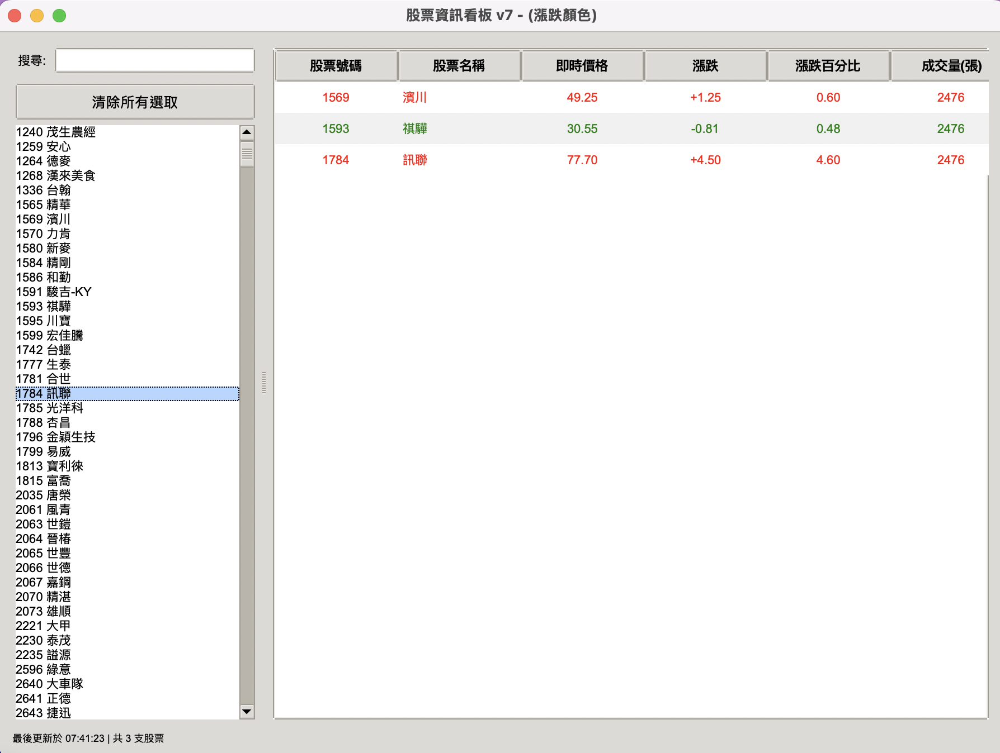

# 專案 04：股票即時監控 GUI

這是由 AI 協助完成的 Crawl4AI + tkinter 即時看板。使用者選取股票後，畫面會定期更新價格、漲跌與成交量；核心版本專注於即時顯示，不保存歷史。



## 完成後你會學會

- 把 Crawl4AI 爬蟲與 tkinter UI 分層
- 使用 thread、queue 與 `after()` 安全更新畫面
- 維持搜尋後的股票選取狀態
- 排程更新並避免重複建立無限任務
- 判斷即時監控何時才需要歷史資料

## 前置準備

1. 先完成[專案 03](../03_股票批次爬取_GUI/README.md)。
2. 在 repo 根目錄執行：

```bash
uv sync
uv run crawl4ai-setup
```

## 專案檔案

```text
04_股票即時監控_GUI/
├── main.py       # tkinter 即時看板
├── wantgoo.py    # Crawl4AI 爬蟲模組
├── PRD.md        # AI 協作需求文件
└── README.md
```

## 完成步驟

1. 開啟 [`wantgoo.py`](wantgoo.py)，確認 `get_stock_data()` 接收多個 URL 並回傳 `list[dict]`。
2. 開啟 [`main.py`](main.py)，找出 worker thread、queue、`process_queue()` 與 `schedule_next_update()`。
3. 從 repo 根目錄執行：

```bash
uv run python crawl4AI/實戰專案/04_股票即時監控_GUI/main.py
```

4. 在左側搜尋股票，以一般點擊、Command/Ctrl 或 Shift 選取少量項目。
5. 確認右側出現股票代碼、名稱、價格、漲跌、漲跌百分比與成交量。
6. 保持程式開啟，等待下一次更新；確認狀態列時間改變，畫面期間仍可操作。
7. 按「清除所有選取」，確認右側資料與選取狀態都清除。
8. 能說明 thread、queue、asyncio 的分工後，再決定是否使用 AI 加入歷史模式。

## 驗收清單

- [ ] 程式能開啟且搜尋股票。
- [ ] 多選股票後能顯示即時資料。
- [ ] 更新期間 UI 不凍結，也不重複堆疊更新任務。
- [ ] 上漲與下跌有可辨識的視覺狀態，不只依賴顏色。
- [ ] 清除選取可正確重設畫面。
- [ ] 預設模式不建立 CSV、XLSX 或資料庫。

## 資料儲存判斷

**預設不保存。**這是即時看板，最新值比歷史檔重要。只有延伸目標是畫趨勢圖時，才由 AI 加入「歷史模式」，使用本機 SQLite 保存時間序列，提供保留天數與清除功能；不可使用雲端資料庫。單次匯出則使用 CSV。

[複製 AI Prompt 04：建立可選的 SQLite 歷史模式 →](../AI資料儲存Prompt.md#prompt-04)

## 常見問題

### 更新期間畫面卡住

網路與 Crawl4AI 工作不可在 tkinter 主執行緒直接執行；widget 也不可從 worker thread 直接修改。

### 股票欄位顯示 N/A

先確認網站可開啟與頁面是否改版，再檢查 selector／解析規則。不要用高頻重試造成額外負擔。

[產品需求文件](PRD.md) | [返回實戰專案總覽](../README.md)
